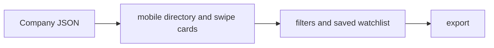

# AI Book — Project Brief

## At a glance

| Field | Value |
|---|---|
| Portfolio area | AI and market intelligence |
| Repository | [jjshay/ai-book](https://github.com/jjshay/ai-book) |
| Status | Source available; runtime not revalidated in this documentation review |
| Evidence review | 2026-09-11; [commit 146f567](https://github.com/jjshay/ai-book/tree/146f5679b802dcb3b869371c8b9d41d0cfccbf58) |

## Problem and intended value

Company research needs a browsable shortlist instead of scattered notes and disconnected market news.

The intended value is a repeatable workflow whose inputs, transformations, and outputs can be inspected. Use the evidence below to distinguish implementation from business outcomes.

## Architecture and data flow

Company JSON → mobile directory and swipe cards → filters and saved watchlist → export.

## Implementation evidence

| Source | Reading purpose |
|---|---|
| [aibook.html](../aibook.html) | Implementation component supporting the data flow described above. |
| [auto-updater/run-update.js](../auto-updater/run-update.js) | Implementation component supporting the data flow described above. |

The links above point to the current repository. The review reference identifies the version used to prepare this brief.

## Setup and operation

Use the existing [README](../README.md) for setup and operating commands. Configuration and dependency references: the source entry points and the existing README.

Start with sample or fixture inputs. Where external services are involved, configure a test account and check the distinction between a local preview, a generated artifact, and a remote write. Credentials and operational datasets are environment-specific.

## Validation and outcomes

**Review result:** Repository tree and referenced source reviewed. Existing application tests, hosted deployments, paid providers, and external mutations were not re-run in this documentation review.

No conventional test suite was identified in the reviewed repository tree; validation should begin with the next improvement below.

The source implements the workflow described above. No new revenue, accuracy, conversion, or production-uptime result is asserted by this documentation update.

Documentation itself is checked by `python3 scripts/check_project_docs.py`; that check validates this structure and its source references, not application behavior.

## Decisions and limitations

A static data-driven interface is portable and easy to distribute; freshness and provenance depend on the enrichment pipeline.

Keep provider-dependent observations dated and separate from deterministic transformations. State which assumptions a demonstration uses and which integrations it actually exercises.

## Interview talking points

- **Problem and product judgment:** Explain why this workflow mattered to its intended operator: Company research needs a browsable shortlist instead of scattered notes and disconnected market news.
- **Technical walkthrough:** Trace one concrete input through this sequence: Company JSON → mobile directory and swipe cards → filters and saved watchlist → export.
- **Engineering tradeoff:** A static data-driven interface is portable and easy to distribute; freshness and provenance depend on the enrichment pipeline.
- **Evidence and ownership:** Open the source links above, identify the specific design or implementation decisions you personally drove, and distinguish AI-assisted implementation from measured operating results.
- **What comes next:** Separate source-backed facts from editorial scores and attach observation dates to company fields.

## Next improvements

Separate source-backed facts from editorial scores and attach observation dates to company fields.

Record any follow-up result with a date, exact command or evaluation method, input scope, observed output, and limitations. Update `project.json` alongside this brief.

## Related projects

- [TradeRadar](https://github.com/jjshay/TradeWatch) — AI and market intelligence.
- [AI Book Updater](https://github.com/jjshay/ai-book-updater) — AI and market intelligence.
- [News Intelligence Engine](https://github.com/jjshay/intelligence-engine) — AI and market intelligence.
- [Market Briefing and Alerts](https://github.com/jjshay/jj-market-alert) — AI and market intelligence.

Some related repositories require authorized GitHub access.
